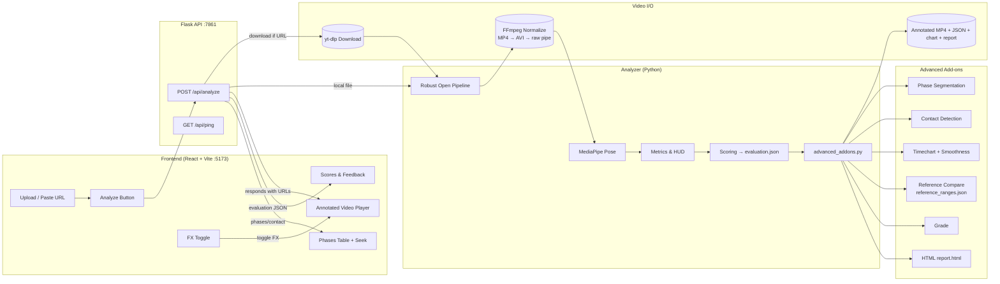

# FrontFoot AI – Cover Drive Analysis

Pose-based, per-frame analysis of a cricket cover drive with a neon, interactive UI.
The system downloads or accepts a local video, runs MediaPipe Pose and custom biomechanics, overlays a HUD on every frame, and produces an annotated MP4 plus a JSON evaluation. Advanced add-ons include automatic phase segmentation, contact-moment detection, a timeline chart, a reference comparison, a grade, and an HTML report.

---

## Demo (screen recording)

https://github.com/user-attachments/assets/35cbccb2-578a-45de-84e4-f5b9ea96f252

---

## Contents

* [Features](#features)
* [Prerequisites](#prerequisites)
* [Quickstart (Windows)](#quickstart-windows)
* [Quickstart (macos--linux)](#quickstart-macos--linux)
* [Project Structure](#project-structure)
* [How It Works](#how-it-works)
* [Architecture](#architecture)
* [Running the Analyzer from CLI](#running-the-analyzer-from-cli)
* [Backend API](#backend-api)
* [Frontend UX](#frontend-ux)
* [Metrics, Thresholds, and Scoring](#metrics-thresholds-and-scoring)
* [Outputs](#outputs)
* [Configuration](#configuration)
* [Troubleshooting](#troubleshooting)
* [Notes](#notes)

---

## Features

* **Robust decoding pipeline** (OpenCV → normalized MP4 → MJPEG-AVI → FFmpeg raw pipe) to handle “unsupported video” issues.
* **Per-frame pose** via MediaPipe Pose; resilient to partial detections.
* **Biomechanics**: elbow angle, spine lean, head–knee alignment, front-foot angle.
* **HUD overlays** on every frame with neon “glass” styling and pass/fail cues.
* **Final evaluation** (`evaluation.json`) with category scores and coach-style feedback.
* **Modern UI** (React + Vite) with a toggleable Three.js FX background.
* **Browser-safe video output**: `annotated_browser.mp4` (`libx264`, `yuv420p`, `faststart`) for maximum compatibility.

**Advanced add-ons (in `advanced_addons.py`):**

* Automatic **phase segmentation**: Stance → Stride → Downswing → Follow-through (+ optional Recovery), stabilized with smoothing/hysteresis.
* **Contact-moment** detection heuristic (min head–knee gap or max elbow velocity).
* **Temporal smoothness** metrics + **timechart** PNG export.
* **Reference comparison** to `reference_ranges.json` (target angle ranges).
* **Skill grade** prediction (Beginner / Intermediate / Advanced).
* One-click **HTML report** (`report.html`) aggregating scores, phases, comparison, and timeline.

---

## Prerequisites

### System

* Python **3.10+**
* FFmpeg (on PATH)
* Node.js **20.19+** (22.x also supported)
* Git (optional)

### Python packages

If using `requirements.txt`:

```
numpy
opencv-python
mediapipe
yt-dlp
flask
matplotlib
```

### Install FFmpeg

* **Windows** (Admin PowerShell):

  ```powershell
  winget install Gyan.FFmpeg
  ```

  Then open a new terminal and verify:

  ```powershell
  ffmpeg -version
  ffprobe -version
  ```

* **macOS**:

  ```bash
  brew install ffmpeg
  ```

* **Linux (Debian/Ubuntu)**:

  ```bash
  sudo apt update && sudo apt install -y ffmpeg
  ```

---

## Quickstart (Windows)

```powershell
# 1) Clone or open the project folder
cd C:\Users\Admin\Desktop\athleterise

# 2) Python venv + deps
python -m venv venv
.\venv\Scripts\activate
pip install -r requirements.txt

# 3) Run backend (Flask on :7861)
python api.py
```

In a second PowerShell window:

```powershell
# 4) Frontend
cd C:\Users\Admin\Desktop\athleterise\frontend
npm install
npm run dev    # Vite on :5173
```

Open [http://localhost:5173](http://localhost:5173) and upload a video or paste a YouTube Shorts URL.

---

## Quickstart (macOS / Linux)

```bash
# Backend
cd ~/athleterise
python3 -m venv venv
source venv/bin/activate
pip install -r requirements.txt
python api.py
```

In another terminal:

```bash
# Frontend
cd ~/athleterise/frontend
npm install
npm run dev
```

Open [http://localhost:5173](http://localhost:5173).

---

## Project Structure

```
athleterise/
├─ api.py
├─ cover_drive_analysis_realtime.py        # Analyzer: robust open + pose + HUD + scores
├─ advanced_addons.py                      # Phases, contact, chart, reference compare, grade, report
├─ reference_ranges.json                   # Target ranges used for reference comparison
├─ frontend/
│  ├─ public/
│  │  └─ output/                           # Analyzer outputs served by Vite (per-run folders)
│  └─ src/
│     ├─ App.jsx                           # Main UI (phases table + seek)
│     ├─ FXBackground.jsx                  # Three.js background (toggleable)
│     └─ index.css                         # Tailwind + custom styles
└─ output/ (optional local)
```

---

## How It Works

1. **Input**

   * Upload a local file or paste a YouTube URL (Shorts supported via `yt-dlp`).

2. **Normalization**

   * The backend ensures a decodable stream:

     * Try original via OpenCV
     * Else normalize to **H.264 MP4**
     * Else to **MJPEG AVI**
     * Else decode frames via **FFmpeg raw pipe**

3. **Pose & Metrics**

   * MediaPipe Pose per frame → landmarks → angles/distances.
   * Neon HUD text and pass/fail cues are drawn on each frame.

4. **Extras**

   * Phase segmentation, contact frame, smoothness chart, reference comparison, grade, and report occur after the per-frame pass.

5. **Outputs**

   * Annotated MP4, `evaluation.json`, optional `timechart.png` and `report.html` written to `frontend/public/output/run_<timestamp>/`.
   * `annotated_browser.mp4` guarantees inline playback.

---

## Architecture



---

## Running the Analyzer from CLI

You can bypass the UI and run the analyzer directly:

```bash
# Using a YouTube link
python cover_drive_analysis_realtime.py --video-url https://youtube.com/shorts/XXXXXX --front-side right --output-dir output

# Using a local file
python cover_drive_analysis_realtime.py --video-path path/to/video.mp4 --front-side left --output-dir output

# Faster mode (lower res + simpler model)
python cover_drive_analysis_realtime.py --video-path path/to/video.mp4 --front-side right --output-dir output --fast
```

Flags:

* `--front-side` in `{right,left}` controls which arm/leg are considered “front”.
* `--fast` reduces target resolution and model complexity for higher FPS.
* `--output-dir` is where annotated video and JSON are written.

---

## Backend API

### `POST /api/analyze`

**Form fields**

* `front_side` (string; `right` or `left`; default `right`)
* `video_url` (string; optional)
* `video_file` (file; optional) — provide either `video_url` or `video_file`
* `fast` (string; optional; accepts `true/false/1/0/on/off`)

**Response (200)**

```json
{
  "ok": true,
  "runId": "run_1712345678",
  "video_url": "/output/run_1712345678/annotated_browser.mp4",
  "video_mime": "video/mp4",
  "eval_url": "/output/run_1712345678/evaluation.json",
  "evaluation": { "...": { "score": 10, "feedback": "..." } },
  "avg_fps": 12.34,

  "phases": [
    {"label":"Stance","start":0,"end":9},
    {"label":"Stride","start":9,"end":28},
    {"label":"Downswing","start":28,"end":40},
    {"label":"Follow-through","start":40,"end":75}
  ],
  "contact_frame": 33,
  "grade": "Intermediate",
  "source_fps": 30.0,
  "chart_url": "/output/run_1712345678/timechart.png",
  "report_url": "/output/run_1712345678/report.html"
}
```

**Errors**

* 400: invalid input or download failure
* 500: internal error during normalization/analysis

### `GET /api/ping`

```json
{"pong": true}
```

---

## Frontend UX

* **Upload or paste URL**, choose front-side, click **Analyze**.
* **Annotated video** is shown inline; buttons for **Open in new tab**, **Download video**, **evaluation.json**, `report.html`, and `timechart.png`.
* **Phases table** lists phase label, frame spans, and timestamps with a **Seek** button to jump the video to the phase start.
* **FX toggle** suspends the Three.js background during playback to maximize decoding FPS.

---

## Metrics, Thresholds, and Scoring

Per-frame metrics:

* **Elbow angle (°)** – `angle(shoulder–elbow–wrist)`
* **Spine lean (°)** – vector from hip-center to shoulder-center vs. vertical
* **Head–knee gap (normalized)** – horizontal distance between nose and front knee, normalized by shoulder width (≤ 0.35 is good)
* **Front-foot angle (°)** – angle of toe–heel line vs. x-axis (≤ 25° is good)

Thresholds (tunable in `cover_drive_analysis_realtime.py`):

```python
THRESH = {
    "elbow_good_min": 80.0,
    "elbow_good_max": 140.0,
    "spine_lean_good_min": 10.0,
    "spine_lean_good_max": 30.0,
    "head_knee_good_max": 0.35,
    "foot_angle_good_max": 25.0,
}
```

Scoring: median of each metric over the clip → mapped to five categories:
Footwork, Head Position, Swing Control, Balance, Follow-through.

---

## Outputs

Per analysis run (timestamped folder):

```
frontend/public/output/run_<epoch>/
├─ annotated_browser.mp4     # Browser-safe H.264 MP4
├─ annotated_video.mp4|.avi  # Writer’s raw output (fallback dependent)
├─ evaluation.json
├─ timechart.png             # Elbow & spine timeline (if enabled)
└─ report.html               # Compact HTML report (if enabled)
```

---

## Configuration

* **Front side**: set in the UI or CLI (`--front-side`).
* **Thresholds**: edit `THRESH` in `cover_drive_analysis_realtime.py`.
* **Reference targets**: edit `reference_ranges.json` (min/max for each metric).
* **Model complexity**: adjust `model_complexity` in the MediaPipe Pose constructor or use `--fast`.
* **Performance**:

  * Use **FX OFF** during playback to free GPU/CPU.
  * `--fast` lowers resolution and simplifies the pose model.

---

## Troubleshooting

* **Inline video doesn’t play**
  The backend emits `annotated_browser.mp4` (`yuv420p`, faststart). If a browser still refuses to autoplay inline, use **Open in new tab** or **Download video**. Check DevTools → Network: ensure 200 with `video/mp4`.

* **“Unsupported video” at analyzer start**
  Confirm FFmpeg is on PATH. The analyzer will attempt normalized MP4, then MJPEG-AVI, then raw pipe.

* **Mediapipe not found**
  Install packages inside the venv:
  `pip install mediapipe opencv-python numpy matplotlib yt-dlp flask`

* **Low preview FPS**
  Turn **FX OFF** in the UI. Use `--fast` to process at a lower resolution.

* **Vite dev proxy**
  The frontend calls `/api/analyze`. Ensure your `vite.config.js` proxies to `http://127.0.0.1:7861`.

---

## Notes

* The analyzer is modular: `analyze()` returns paths and aggregated results suitable for other services.
* For production, move outputs out of `/public` if you need private storage or signed URLs.
* Future work: bat/ball detection, tighter impact detection, phase recognition with temporal models, smoothness from joint velocities, richer reports.

---
