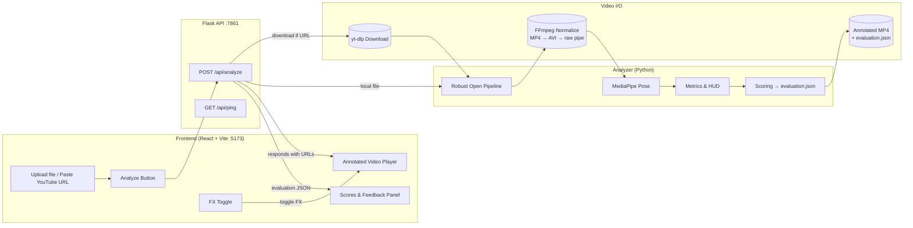

---

# FrontFoot AI – Cover Drive Analysis

Pose-based, per-frame analysis of a cricket cover drive with a neon, interactive UI.
The system downloads or accepts a local video, runs MediaPipe Pose and custom biomechanics, overlays a HUD on every frame, and produces an annotated MP4 plus a JSON evaluation.

---

## Demo (screen recording)

<video
  src="https://raw.githubusercontent.com/Hitme02/FrontFoot-AI/main/recording.mp4.mp4"
  controls
  playsinline
  muted
  width="100%">
</video>

---

## Contents

* [Features](#features)
* [Prerequisites](#prerequisites)
* [Quickstart (Windows)](#quickstart-windows)
* [Quickstart (macos--linux)](#quickstart-macos--linux)
* [Project Structure](#project-structure)
* [How It Works](#how-it-works)
* [Architecture](#architecture)
* [Running the Analyzer from CLI](#running-the-analyzer-from-cli)
* [Backend API](#backend-api)
* [Metrics, Thresholds, and Scoring](#metrics-thresholds-and-scoring)
* [Outputs](#outputs)
* [Configuration](#configuration)
* [Troubleshooting](#troubleshooting)
* [Notes](#notes)

---

## Features

* **Robust decoding pipeline** (OpenCV → normalized MP4 → MJPEG-AVI → FFmpeg raw pipe) to handle “unsupported video” issues.
* **Per-frame pose** via MediaPipe Pose; resilient to partial detections.
* **Biomechanics**: elbow angle, spine lean, head–knee alignment, front-foot angle.
* **HUD overlays** on every frame with neon glass styling and ✅/❌ cues.
* **Final evaluation** (`evaluation.json`) with category scores and coach-like text.
* **Modern UI** (React + Vite) with a background FX canvas (toggleable to protect FPS).
* **Browser-safe video output**: final MP4 (`libx264`, `yuv420p`, `faststart`) for maximum compatibility.

---

## Prerequisites

### System

* Python **3.10+**
* FFmpeg (on PATH)
* Node.js **20.19+** (22.x also supported)
* Git (optional)

### Python packages

If you use `requirements.txt`:

```
numpy
opencv-python
mediapipe
yt-dlp
flask
```

If you don’t have a `requirements.txt`, you can install the above manually.

### Install FFmpeg

* **Windows** (Admin PowerShell):

  ```powershell
  winget install Gyan.FFmpeg
  ```

  Then open a **new** terminal and confirm:

  ```powershell
  ffmpeg -version
  ffprobe -version
  ```
* **macOS**:

  ```bash
  brew install ffmpeg
  ```
* **Linux (Debian/Ubuntu)**:

  ```bash
  sudo apt update && sudo apt install -y ffmpeg
  ```

---

## Quickstart (Windows)

```powershell
# 1) Clone or open the project folder
cd C:\Users\Admin\Desktop\athleterise

# 2) Python venv + deps
python -m venv venv
.\venv\Scripts\activate
pip install -r requirements.txt   # or install packages listed above

# 3) Run backend (Flask on :7861)
python api.py
```

In a second PowerShell window:

```powershell
# 4) Frontend
cd C:\Users\Admin\Desktop\athleterise\frontend
npm install
npm run dev    # Vite on :5173
```

Open [http://localhost:5173](http://localhost:5173) and use either file upload or a YouTube Shorts URL.

---

## Quickstart (macOS / Linux)

```bash
# Backend
cd ~/athleterise
python3 -m venv venv
source venv/bin/activate
pip install -r requirements.txt   # or install packages listed above
python api.py
```

In another terminal:

```bash
# Frontend
cd ~/athleterise/frontend
npm install
npm run dev
```

Open [http://localhost:5173](http://localhost:5173).

---

## Project Structure

```
athleterise/
├─ api.py                         # Flask API (POST /api/analyze)
├─ cover_drive_analysis_realtime.py
│                                 # Analyzer: robust open + pose + HUD + scores
├─ frontend/
│  ├─ public/
│  │  └─ output/                  # Analyzer outputs served by Vite (per-run folders)
│  └─ src/
│     ├─ App.jsx                  # Main UI
│     ├─ FXBackground.jsx         # Three.js background (toggleable)
│     └─ index.css                # Tailwind + custom styles
└─ output/ (optional local)
```

---

## How It Works

1. **Input**

   * Upload a local file or paste a YouTube URL (Shorts supported via `yt-dlp`).
2. **Normalization**

   * The backend ensures a decodable stream:

     * Try original via OpenCV
     * Else normalize to **H.264 MP4**
     * Else to **MJPEG AVI**
     * Else decode frames via **FFmpeg raw pipe**
3. **Pose & Metrics**

   * MediaPipe Pose per frame → landmarks → angles/distances.
   * Neon HUD text and ✅/❌ cues are drawn on each frame.
4. **Outputs**

   * Annotated MP4 and `evaluation.json` are written to `frontend/public/output/run_<timestamp>/`.
   * A browser-safe MP4 copy (`annotated_browser.mp4`) is produced to guarantee playback in `<video>`.

---

## Architecture



---

## Running the Analyzer from CLI

You can bypass the UI and run the analyzer directly:

```bash
# Using a YouTube link
python cover_drive_analysis_realtime.py --video-url https://youtube.com/shorts/XXXXXX --front-side right --output-dir output

# Using a local file
python cover_drive_analysis_realtime.py --video-path path/to/video.mp4 --front-side left --output-dir output
```

Flags:

* `--front-side` in `{right,left}` controls which arm/leg are considered “front”.
* `--output-dir` is where annotated video and JSON are written.

---

## Backend API

### `POST /api/analyze`

**Form fields**

* `front_side` (string; `right` or `left`; default `right`)
* `video_url` (string; optional)
* `video_file` (file; optional) — supply either `video_url` or `video_file`

**Response (200)**

```json
{
  "ok": true,
  "runId": "run_1712345678",
  "video_url": "/output/run_1712345678/annotated_browser.mp4",
  "video_mime": "video/mp4",
  "eval_url": "/output/run_1712345678/evaluation.json",
  "evaluation": {
    "Footwork":   {"score": 10, "feedback": "Front foot points down the line; square slightly if angle > 20°."},
    "Head Position":{"score": 6, "feedback": "Keep head stacked over front knee through contact."},
    "Swing Control":{"score": 8, "feedback": "Smooth V-shaped arc; avoid abrupt elbow snaps."},
    "Balance":     {"score": 10, "feedback": "Maintain 10–20° forward spine lean; avoid falling off-side."},
    "Follow-through":{"score": 7, "feedback": "Finish high with control; stable base after impact."}
  },
  "avg_fps": 12.34
}
```

**Errors**

* 400: invalid input or download failure
* 500: internal error during normalization/analysis

### `GET /api/ping`

```json
{"pong": true}
```

---

## Metrics, Thresholds, and Scoring

Per-frame metrics:

* **Elbow angle (°)** – at front elbow: `angle(shoulder–elbow–wrist)`.
* **Spine lean (°)** – vector from hip-center to shoulder-center vs. vertical.
* **Head–knee gap (normalized)** – horizontal distance between nose and front knee, normalized by shoulder width (≤ 0.35 is good).
* **Front-foot angle (°)** – angle of toe–heel line vs. x-axis (≤ 25° is good).

Thresholds used for ✅/❌ cues (tunable in `cover_drive_analysis_realtime.py`):

```python
THRESH = {
    "elbow_good_min": 80.0,
    "elbow_good_max": 140.0,
    "spine_lean_good_min": 10.0,
    "spine_lean_good_max": 30.0,
    "head_knee_good_max": 0.35,
    "foot_angle_good_max": 25.0,
}
```

Scoring:

* We median-filter each metric over the video (ignoring NaNs) and map to five coaching categories:

  * **Footwork** – via front-foot angle (≤ 20° → 10/10 else 6/10)
  * **Head Position** – head–knee gap (≤ 0.3 → 10/10 else 6/10)
  * **Swing Control** – placeholder 8/10 (can be extended to elbow velocity smoothness)
  * **Balance** – spine lean within \~7–22° → 10/10 else 6/10
  * **Follow-through** – placeholder 7/10 (extendable via post-impact windows)

---

## Outputs

Per analysis run (timestamped folder):

```
frontend/public/output/run_<epoch>/
├─ annotated_browser.mp4     # Browser-safe H.264 MP4
├─ annotated_video.mp4|.avi  # Original writer’s output (fallback dependent)
└─ evaluation.json
```

The frontend serves `frontend/public/` statically, so the UI can immediately preview and download results.

---

## Configuration

* **Front side**: set in the UI or the CLI flag (`--front-side`).
* **Thresholds**: edit `THRESH` in `cover_drive_analysis_realtime.py`.
* **Model complexity**: change `model_complexity` in the MediaPipe Pose constructor.
* **Performance**:

  * UI **FX toggle** disables Three.js background during video playback for higher FPS.
  * The background auto-throttles DPR and particle count if performance dips.

---

## Troubleshooting

* **Inline video doesn’t play**
  The backend emits `annotated_browser.mp4` (`yuv420p`, faststart). If Chromium still refuses to inline-play, click **Open in new tab** or **Download Video**. Check DevTools → Network → the video request returns 200 with `video/mp4`.

* **“Unsupported video” at analyzer start**
  Ensure FFmpeg is installed and on PATH. The analyzer will normalize to MP4 or MJPEG AVI or pipe frames if needed.

* **Mediapipe not found**
  Install packages in the venv: `pip install mediapipe opencv-python numpy`.

* **Low FPS while previewing**
  Toggle **FX OFF** in the UI, or let it auto-pause when the `<video>` plays. This frees GPU for decoding.

* **Ports**
  Frontend runs on `:5173`, backend on `:7861`. Make sure nothing else occupies those ports.

---

## Notes

* The analyzer is designed to be modular: the `analyze()` function returns paths and aggregated results you can reuse in other services.
* For production, move outputs out of `/public` if you need private storage or signed URLs.
* To extend the system, consider phase detection (pick-up → back-swing → downswing → impact → follow-through), bat/ball detection, or smoothness metrics from joint velocities.
